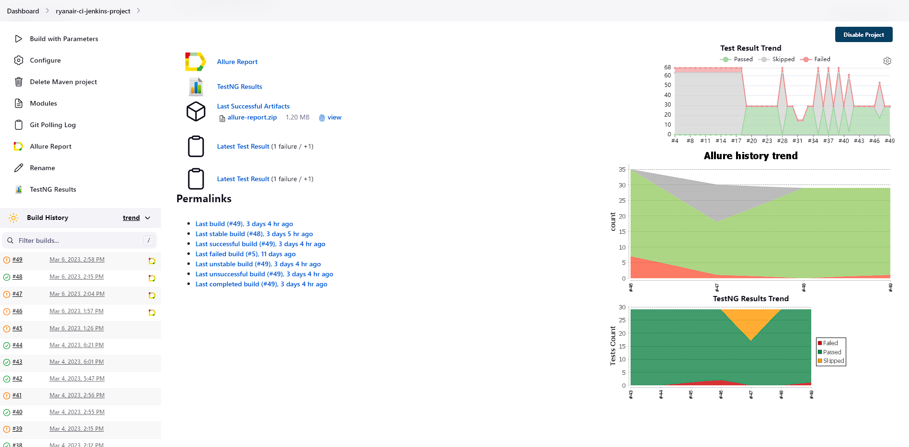
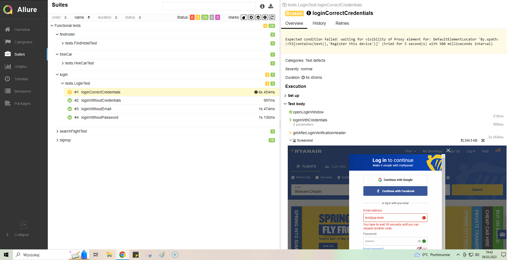

## Ryanair airlines Java automation test suite created with Selenium WebDriver
## Used Technologies:
* programming language: Java
* testing framework: testNG
* web framework: Selenium Webdriver
* version control system: git
* continuous integration tool: Jenkins
* test report tool: Allure

## Jenkins report

## Allure failed test report

